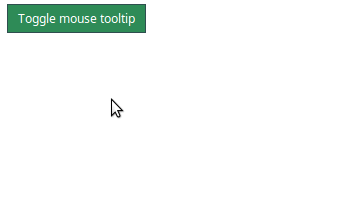

# react-sticky-mouse-tooltip
React tooltip component that follow mouse cursor. You can pass as children any HTML element or other React component.

<p align="center">
  
</p>

## Installation
`npm install react-sticky-mouse-tooltip --save`

or

`yarn add react-sticky-mouse-tooltip`

## Example
```typescript
import React from 'react';
import MouseTooltip from 'react-sticky-mouse-tooltip';

const Preview:FunctionalComponent = () => {
  
  const [isMouseTooltipVisible, setIsMouseTooltipVisible] = useState<boolean>(false)

  const toggleMouseTooltip = () => {
    setIsMouseTooltipVisible(!isMouseTooltipVisible)
  };

  return (
    <div>
      <button onClick={toggleMouseTooltip} style={buttonStyle}>
        Toggle mouse tooltip
      </button>
      <MouseTooltip
        visible={isMouseTooltipVisible}
        offsetX={15}
        offsetY={10}
      >
        <span>Follow the cursor!</span>
      </MouseTooltip>
    </div>
  );
}
```

## Attributes
| Attribute | Description | Type | Required | Default value |
| --- | --- | --- | --- | --- |
| visible | Visibility of component. | ```boolean``` | No | ```true``` |
| offsetX | Offset along X axis. | ```number``` | No | ```0``` |
| offsetY | Offset along Y axis. | ```number``` | No | ```0``` |
| className | Tooltip ```div``` class name. | ```string``` | No | - |
| style | Styles properties of tooltip ```div```. | ```object``` | No | - |

## License
MIT
